# Ecommerce Web Application

Van Goh Library is a website where users can find a wide selection of books and make purchases online in a simple and secure way. The application features search and filtering capabilities to help users quickly and efficiently find the books they want to buy.

Users can search for books and also filter search results by genre, price and ratings. Each book has a details page where price, ratings, author, genre, number of pages,  publisher and language are displayed. They can add the books they wish to purchase to their shopping cart and view the contents of their cart at any time.

The application also enables users to make purchases securely using credit or debit cards. Once users have made a purchase, they can view their purchase history in their profile and also receive an invoice email.

It also have an admin side where you can add, edit and delete books.

## BackEnd:
- .Net 5
- C#
- ASP .NET

## FrontEnd:

- HTML 5
- CSS 3
- JavaScript
- React

## Database and ORM:

- SQL Server
- Entity Framework

### 1. Home

This is the main page where we show the products and different options to navigate the website.

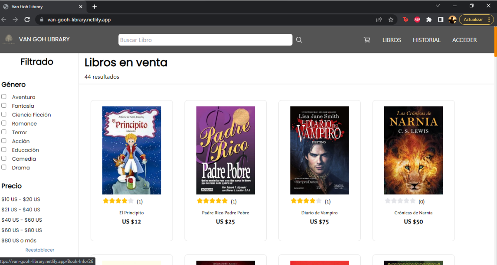

### 2. Filters

This filtering section brings the books according to the applied filters. They can be used in combination with others or individually.

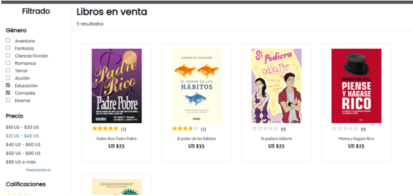

### 3. Book

Book detail page where we can see the price, ratings, author, genre, number of pages, publisher and language. 

### 4. Add a book to the cart

If we click the botton can add the book to the cart.

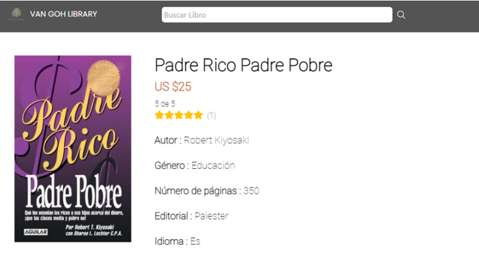
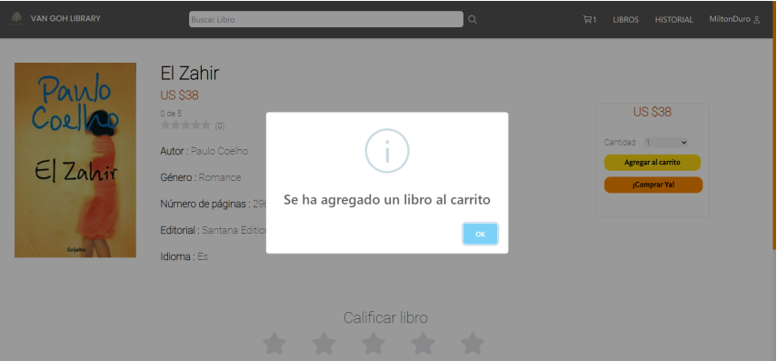

### 5. Cart

If we clic the cart, we can see the articles with it's price and the quantity.

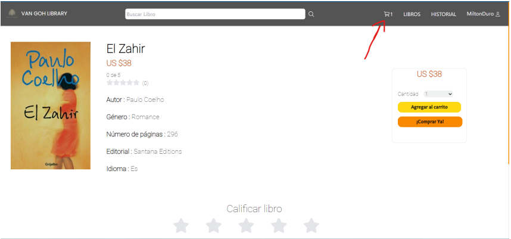
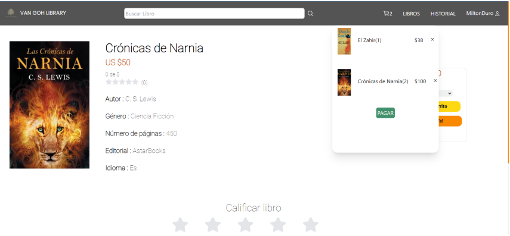

### 5. Payment page

Payment section that contains all the data to pay such as card details, our address, country and a short summary of our purchase.

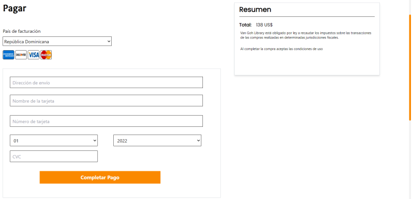
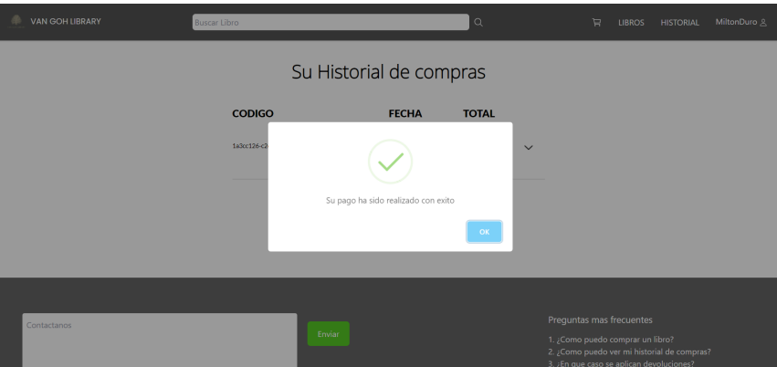

### 6. Purchase history

After making any purchase we can see our purchases in the "History" section that is at the top right of our page that will show us the details.

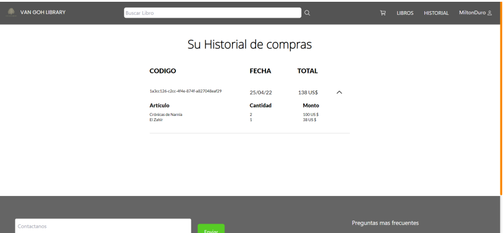

### 7. Admin side

Admin side where an administrator can see the list of books in the store.

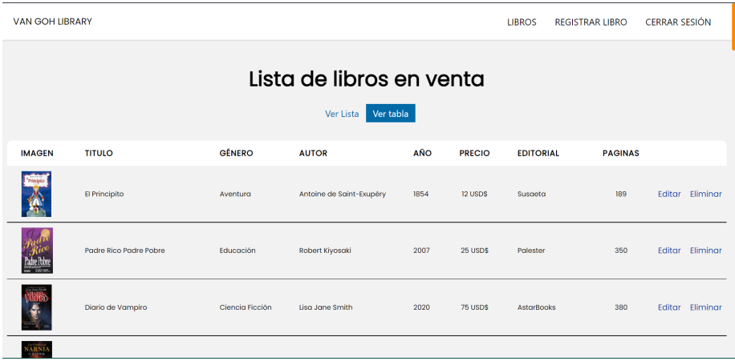

### 8. Register a book

In this section an admin can register the books of the store.

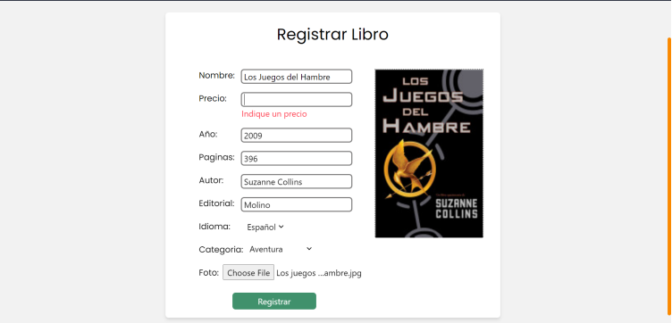
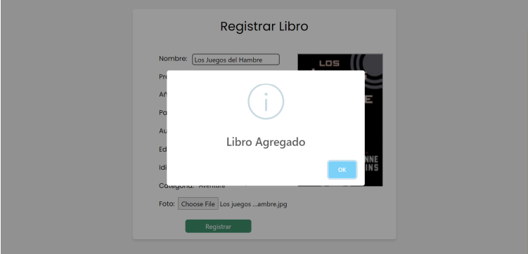

### 9. Edit a book

In this section an admin can edit a book of the store.

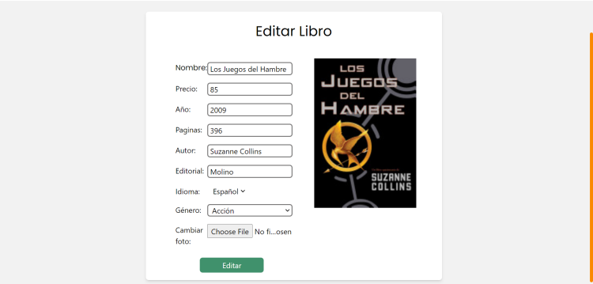
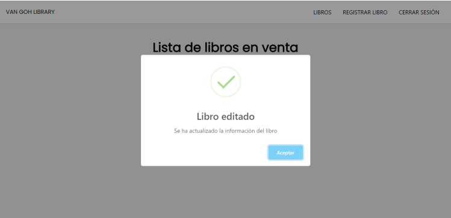

### 10. Delete a book

After an admin press the delete button we are see a modal confirmation, if we decide to continue; we delete the book of the store.

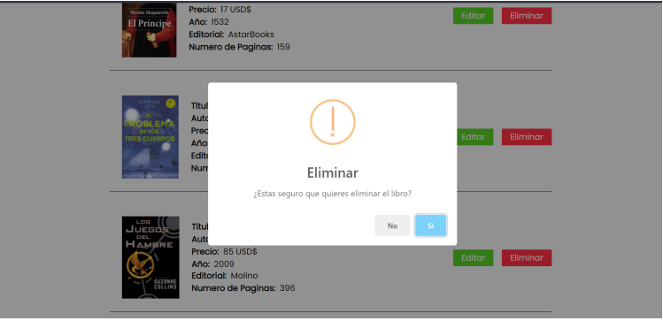
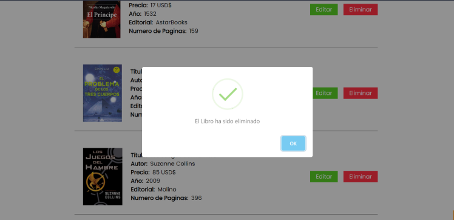